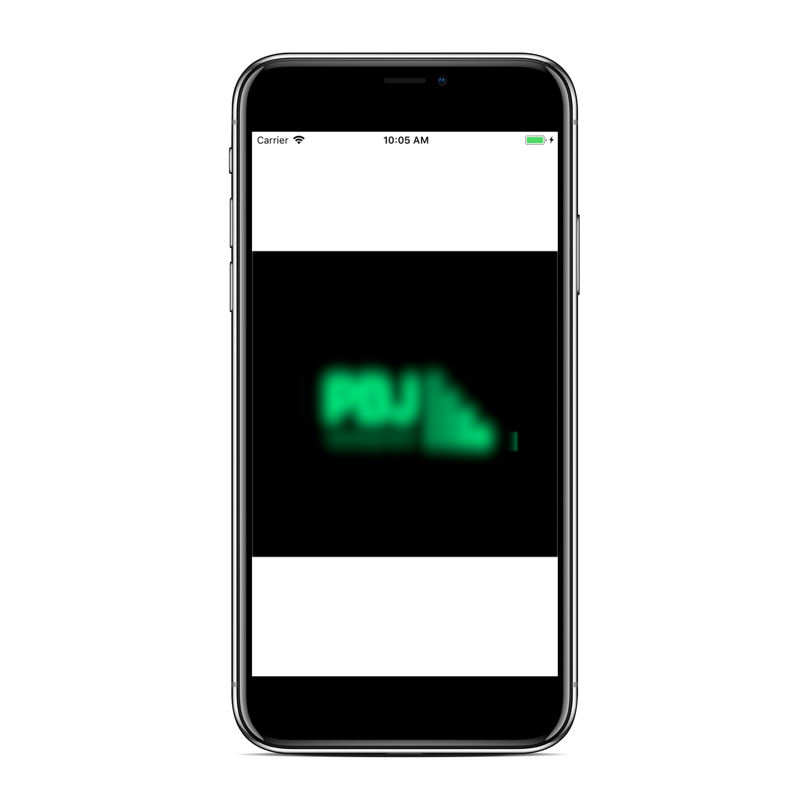

# PBJEffects

[](https://travis-ci.org/SnugJoker/PBJEffects)
[](http://cocoapods.org/pods/PBJEffects)
[](http://cocoapods.org/pods/PBJEffects)
[](http://cocoapods.org/pods/PBJEffects)
[](https://bettercodehub.com/)

## Description
PBJEffects is a nice collection of cool effects.

## Example


## Requirements
No requirements needed.

## Installation
PBJEffects is available through [CocoaPods](http://cocoapods.org). 
To install it, simply add the following line to your Podfile:

```ruby
pod 'PBJEffects'
```

## How To Use
To use PBJAnimations first import the class:

```objectivec
#import "PBJEffects.h"
```

Then simply add one of the methods to your code:

#### Objective C ####       
* Shadow
   
```objectivec
+(void)addShadowToView:(UIView *)view withShadowType:(ShadowType)shadowType;
+(void)addMoreGentleShadowToView:(UIView *)view;
+(void)addTrapezoidalShadowToView:(UIView *)view;
+(void)addEllipticalBottomShadowToView:(UIView *)view;
+(void)addShadowTypeCurlBottomShadowToView:(UIView *)view;
+(void)addShadowToView:(UIView *)view;
+(void)addShadowToView:(UIView *)view onSuperView:(UIView *)superView;
+(UIView *)addShadowView:(UIView *)viewShadow toView:(UIView *)view onSuperView:(UIView *)superView;
```

* Fade
    
```objectivec
+(void)fadeInView:(UIView *)view;
+(void)fadeOutView:(UIView *)view;
```
    
* Blur
       
```objectivec
+(UIView *)addBlurToView:(UIView *)view withStyle:(UIBlurEffectStyle)style;
+(UIImage *)addBlurToImage:(UIImage *)image;
```

* Image Filters
       
```objectivec
+(UIImage *)convertImageToMonoEffect:(UIImage *)image;
+(UIImage *)convertImageToNoirEffect:(UIImage *)image;
+(UIImage *)image:(UIImage *)image withCIFilter:(NSString *)filterName;
+(UIImage *)convertImageToGrayScale:(UIImage *)image;
+(UIImage *)colorizeImage:(UIImage *)image withColor:(UIColor *)color;
```

## Author
Joseph Razon, razonjoe@gmail.com
(Also few parts were inspired by Michael Nachbaur https://github.com/NachoMan)

## License
PBJEffects is available under the MIT license. See the LICENSE file for more info.
